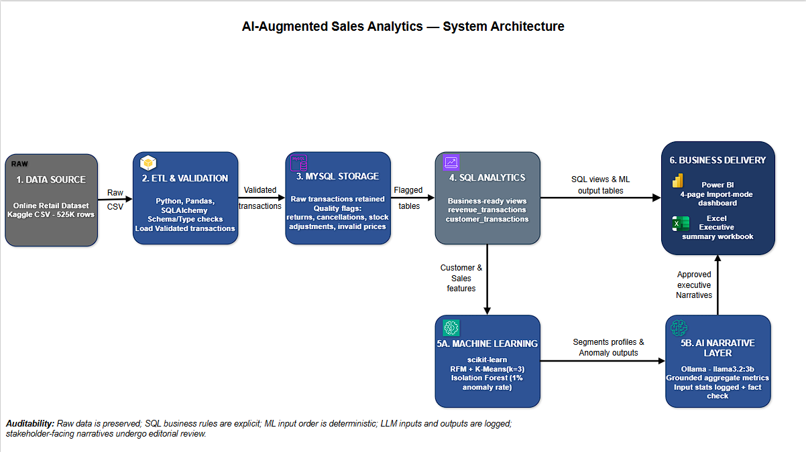

# AI-Augmented Sales & Customer Intelligence Platform

An end-to-end data analytics pipeline built on real-world retail transaction data — from raw CSV to a cleaned MySQL database, machine-learning-driven customer segmentation and anomaly detection, plain-English narrative summaries generated by a local LLM, and executive-ready Power BI / Excel deliverables.

Built as a portfolio project to demonstrate practical, end-to-end data analyst skills: data engineering, SQL, data quality auditing, applied ML, and business-facing reporting.

## Why this project

Most portfolio projects use a clean, synthetic dataset and stop at a dashboard. This one deliberately uses a real, messy retail dataset with real problems — missing IDs, cancellations, inconsistent stock codes — because working through those problems, and being able to explain the reasoning behind each decision, is what the job actually looks like.

## Architecture



## Tech Stack

| Layer | Tool | Why |
|---|---|---|
| Language | Python | Pandas for ETL, scikit-learn for ML |
| Database | MySQL (via SQLAlchemy) | `pd.read_sql` / `df.to_sql` fit an analytics workflow better than a raw connector |
| AI / NLP | Ollama (`llama3.2:3b`), local | Free, offline, no API costs, no data leaves the machine — a deliberate cost/privacy trade-off over a hosted API |
| ML | scikit-learn | Customer segmentation (K-Means), anomaly detection (Isolation Forest) |
| Dashboards | Power BI, Excel | Business-facing deliverables |
| Version control | Git / GitHub | — |

## Dataset

[Online Retail Dataset](https://www.kaggle.com/datasets/lakshmi25npathi/online-retail-dataset) (Kaggle) — real UK online-retailer transactions spanning **Dec 2009–Dec 2010**. Chosen specifically for its real data-quality issues (below), which a clean synthetic dataset wouldn't surface.

## Project Structure

```
ai-sales-analytics/
├── data/
│   ├── raw/          # downloaded CSV (gitignored)
│   └── processed/    # cleaned exports & summaries (tracked in git)
├── python/            # connection, ETL, ML, narrative generation, validation scripts
├── sql/
│   ├── schema.sql
│   ├── migrations/     # incremental schema changes
│   ├── queries/         # exploration & data-quality checks
│   └── views.sql
├── powerbi/            # Sales_Analytics_Dashboard.pbix + page screenshots
├── excel/             # AI_Sales_Analytics_Executive_Summary.xlsx 
└── README.md
```

## Status

- [x] Environment & toolkit setup
- [x] Database schema + connection layer (SQLAlchemy)
- [x] Data ingestion (Kaggle API → MySQL)
- [x] **Data cleaning & quality auditing** (see below)
- [x] **Customer segmentation & anomaly detection** (see below)
- [x] **Narrative generation** (local Ollama LLM) (see below)
- [x] **Power BI dashboard** (see below)
- [x] **Excel executive summary** (see below)
- [x] Architecture diagram (see Architecture, above)

## Data Cleaning & Quality

Rather than deleting messy rows, every row is **kept and flagged**. The raw `transactions` table is never filtered in place — data quality issues are captured as generated columns, and downstream analysis picks the right SQL view for the task. This preserves the full audit trail and lets different analyses (revenue vs. customer segmentation vs. product performance) apply different, explicit inclusion rules instead of silently dropping data upstream.

**Findings** (525,461 rows total):

| Issue | Count | % | Flag | Treatment |
|---|---|---|---|---|
| Missing `customer_id` | 107,927 | 20.54% | `is_missing_customer` | Kept for revenue/product analysis; excluded from customer segmentation (`vw_customer_transactions`) — these are guest checkouts, not bad data |
| Negative quantity | 12,326 | 2.35% | `is_return` | Kept everywhere; netted against purchases in `vw_net_sales` rather than excluded |
| Customer-cancelled orders | 10,206 | 1.94% | `is_cancellation` | Subset of the above — invoice numbers prefixed `C`. Kept as real transactions |
| Internal stock adjustments | 2,121 | 0.40% | `is_stock_adjustment` | Negative quantity but *not* a `C`-prefixed cancellation — investigation showed mostly NULL descriptions plus "damaged" / "given away" / "ebay sales" notes, i.e. warehouse-side corrections rather than customer activity. Excluded from revenue analysis |
| Zero/negative unit price | 3,704 | 0.70% | `is_invalid_price` | Likely free samples or entry errors. Excluded from revenue analysis, kept visible in the raw table |
| Non-product stock codes (`POST`, `M`, `DOT`, `C2`, `BANK CHARGES`, `AMAZONFEE`) | 2,667 | 0.51% | `is_non_product` | Not real products — excluded from product-level analysis to avoid skewing "top sellers" |

**A finding worth calling out:** `is_cancellation` (invoice prefix `C`) and negative quantity looked at first glance like the same thing. They're not — 2,121 rows had negative quantity without a `C`-prefixed invoice. Digging into those rows (NULL descriptions, "damaged"/"given away" notes) showed they were internal stock adjustments, not customer cancellations, which is why `is_return`, `is_cancellation`, and `is_stock_adjustment` exist as three separate flags rather than being collapsed into one.

**Views built on top of the flags:**
- `vw_revenue_transactions` — excludes non-product rows, invalid prices, and stock adjustments; keeps genuine cancellations/returns
- `vw_customer_transactions` — the above, plus excludes guest checkouts (no `customer_id`)
- `vw_net_sales` — purchases and returns netted per product, for accurate revenue figures

Full detail: [`sql/migrations/data_quality_flags.sql`](sql/migrations/data_quality_flags.sql), [`sql/views.sql`](sql/views.sql), and the generated [`data/processed/cleaning_summary.csv`](data/processed/cleaning_summary.csv).

## Customer Segmentation & Anomaly Detection

Two independent ML layers, run on top of the cleaned `transactions` table, both writing their results back into MySQL so they're queryable by Power BI.

### Customer segmentation (RFM + K-Means)

Every customer is reduced to three numbers — **Recency** (days since last purchase), **Frequency** (distinct orders), **Monetary** (total spend) — computed only from genuine sales rows (excludes cancellations, stock adjustments, and non-positive quantity/price). Frequency and Monetary are log-transformed (both are heavily right-skewed) and all three are standard-scaled before clustering.

**k was chosen using both an elbow plot (inertia) and silhouette score** across k=2–8 — silhouette peaked clearly at **k=3** (0.412), and the elbow plot agreed the improvement beyond k=3 was marginal.

**Result — 3 segments across 4,312 customers:**

| Segment | Customers | Avg Recency | Avg Frequency | Avg Monetary |
|---|---|---|---|---|
| Champions | 1,361 | 33 days | 10.1 orders | $5,268 |
| Occasional / Low-Value | 1,996 | 53 days | 2.1 orders | $631 |
| Lost / Lapsed | 955 | 249 days | 1.4 orders | $423 |

Segment names are assigned programmatically by comparing each cluster's average R/F/M against the **overall customer-base median** (not against the other clusters' ranks) — an earlier rank-based version of this logic mislabeled the "Occasional" cluster, which comparing against the median instead fixed.

### Anomaly detection (Isolation Forest)

A separate, transaction-level layer using Isolation Forest on quantity, unit price, total value, and time-of-purchase features. **4,077 of 407,650 genuine-sale transactions flagged** (1%, the assumed contamination rate). Anomalies concentrated heavily in a small number of repeat accounts — the top 3 flagged customers (14646, 18102, 13694) alone accounted for **~25.7% of all anomalies**, each with consistently large order sizes and high average order values, consistent with wholesale/bulk-buying accounts rather than data errors.

**Reproducibility note:** an earlier version of this pipeline produced a different top-3 list on every rerun despite a fixed `random_state`. The cause was a missing `ORDER BY` in the source SQL query — MySQL returned rows in a different order each run, and Isolation Forest's internal sampling is positional, so a fixed seed over an unfixed row order still produced different results. Fixed by adding `ORDER BY id`; two full reruns afterward produced byte-for-byte identical output.

Full pipeline: [`python/segmentation.py`](python/segmentation.py), [`python/anomaly_detection.py`](python/anomaly_detection.py), output tables in [`sql/migrations/create_ml_output_tables.sql`](sql/migrations/create_ml_output_tables.sql).

## Narrative Generation (local Ollama LLM)

The segment profiles and anomaly findings above are numbers a stakeholder still has to interpret. This layer turns them into short, plain-English write-ups using a local `llama3.2:3b` model — three segment narratives, one anomaly-pattern narrative, and one executive summary.

**Design choices:**
- **Aggregated grain, not per-row** — narrates pre-computed group statistics rather than individual customers/transactions.
- **`input_stats` stored alongside every narrative** — the exact numbers fed into each prompt are kept next to the generated text as a permanent audit trail.
- **An automated fact-checking heuristic** (`verify_narrative_facts()`) flags any capitalized word in the output that doesn't appear in `input_stats` — catches invented proper nouns (a country, a name) that weren't actually provided. It's deliberately called a heuristic rather than "verification": it detects one narrow class of unsupported claims and can't validate numerical interpretation or business framing.

**What the automated check does *not* catch — and how that gap is handled:** `verify_narrative_facts()` only catches *fabricated* facts. It does not catch cases where every number is genuinely correct but the framing around it is misleading — for example, an early draft described a customer's average **total** spend as "$X per order," which is a real number described the wrong way, not an invented one. Nothing in that sentence would trip a fabrication check.

Because of this gap, dashboard-facing narrative text goes through a brief **manual editorial pass** before publication, on top of the automated heuristic. The `narratives` table in MySQL retains the raw, unedited LLM output for audit — a genuine record of what the model actually produced — while the text displayed on the Power BI Insights page is the reviewed, approved version, linked back to the same source statistics. This is a deliberate two-layer review (automated heuristic + human framing check) that preserves both traceability and accurate communication.

Full pipeline: [`python/generate_narratives.py`](python/generate_narratives.py), output table in [`sql/migrations/create_narratives_table.sql`](sql/migrations/create_narratives_table.sql), with duplicate-row prevention added in [`sql/migrations/add_narratives_unique_key.sql`](sql/migrations/add_narratives_unique_key.sql) (an earlier version appended a new row on every rerun instead of updating the existing one; this migration added a unique key so reruns now upsert via `INSERT ... ON DUPLICATE KEY UPDATE`).

## Power BI Dashboard

Four pages, built on an Import-mode connection to MySQL (`localhost:3306/ai_sales_analytics`), covering the full pipeline above end to end. The dashboard refreshes from the source when manually refreshed in Power BI Desktop -it is not a live, real-time DirectQuery connection:

- **Sales Overview** — revenue/order/customer KPIs, a monthly revenue trend, top 10 products by revenue, and a date-range slicer.
- **Customer Segments** — segment sizes (donut), segment averages (table), and a log-scaled Frequency-vs-Monetary scatter plot colored by segment, showing visually why K-Means separated the groups the way it did.
- **Anomaly Detection** — a framing note (statistical anomaly ≠ confirmed fraud/error), KPI cards for total flagged and anomaly rate, a top-10-customers-by-anomaly-count chart, and a sortable detail table of every flagged transaction.
- **Insights & Recommendations** — the five narratives from the Ollama layer above, laid out with supporting mini-visuals, executive summary given the most visual weight.

**Setup notes worth remembering:**
- Data Connectivity mode is **Import**, not DirectQuery — chosen because the dataset is small enough that Import gives better dashboard performance, and there's no requirement to reflect every underlying database write in real time.
- Power BI's MySQL connector requires **MySQL Connector/NET** (or ODBC) installed separately from Power BI itself.
- `vw_anomaly_detail` (a convenience view joining `transaction_anomalies` back to full transaction detail) was added specifically so Power Query doesn't need to do that merge itself — see [`sql/migrations/add_powerbi_views.sql`](sql/migrations/add_powerbi_views.sql).
- `python/export_powerbi_data.py` writes a git-friendly CSV fallback copy of every table/view the dashboard uses, into `data/processed/powerbi_export/` — reviewable without a live MySQL connection, same "processed data is tracked in git" logic used elsewhere in this project.

File: [`powerbi/Sales_Analytics_Dashboards.pbix`](powerbi/Sales_Analytics_Dashboards.pbix), with page screenshots alongside it (a live `.pbix` isn't viewable on GitHub directly).

## Excel Executive Summary

A companion workbook for stakeholders who prefer Excel to Power BI, or need an offline, emailable version of the same findings.

- **Executive Summary** — five headline KPIs (total revenue, total orders, distinct customers, top products tracked, anomalies flagged), a top-5-products-by-revenue table, and the raw executive narrative from the Ollama layer, with a note pointing to the README for how the dashboard-facing (edited) version differs.
- **Customer Segments** — the same segment breakdown as the README table above (count, % of total, avg Recency/Frequency/Monetary), a bar chart of customers by segment, and the three raw per-segment narratives.
- **Anomalies** — total flagged, a framing note (statistical anomaly ≠ confirmed fraud/error), a top-10-customers-by-anomaly-count table and bar chart, and the raw anomaly narrative.
- **Five `Raw_*` tabs** (`Raw_DailyRevenue`, `Raw_TopProducts`, `Raw_CustomerSegments`, `Raw_AnomalyDetail`, `Raw_Narratives`) hold the full underlying data these summaries are built from — the same exports `export_powerbi_data.py` writes to `data/processed/powerbi_export/`.

**Formula-driven, not a static snapshot:** every KPI, table, and chart on the three summary sheets is a live formula (`SUM`, `COUNTIF`, `AVERAGEIF`, `COUNTA`) referencing the `Raw_*` tabs, not hardcoded values. Refreshing the data means pasting updated exports into the `Raw_*` tabs and letting the formulas recalculate — the same "processed data is tracked in git, refreshed by rerunning the pipeline" pattern used everywhere else in this project, just in Excel's native formula language instead of SQL views.

File: [`excel/AI_Sales_Analytics_Executive_Summary.xlsx`](excel/AI_Sales_Analytics_Executive_Summary.xlsx)

## Setup

1. Clone the repo, create a `.env` from `.env.example`
2. `pip install -r requirements.txt`
3. `python python/init_db.py` — creates the database and applies the schema
4. `python python/download_data.py` — pulls the dataset from Kaggle
5. `python python/load_data.py` — loads it into MySQL
6. Apply `sql/migrations/data_quality_flags.sql` and `sql/views.sql`
7. `python python/validate_cleaning.py` — confirms the flags and writes the summary CSV
8. Apply `sql/migrations/create_ml_output_tables.sql` — creates the `customer_segments` and `transaction_anomalies` tables
9. `python python/segmentation.py` — runs RFM feature engineering + K-Means
10. `python python/anomaly_detection.py` — runs Isolation Forest anomaly scoring
11. Apply `sql/migrations/create_narratives_table.sql`
12. Make sure Ollama is running with `llama3.2:3b` pulled (`ollama pull llama3.2:3b`)
13. `python python/generate_narratives.py` — generates and writes narratives to MySQL
14. Apply `sql/migrations/add_powerbi_views.sql` — adds `vw_anomaly_detail`
15. `python python/export_powerbi_data.py` — writes the Power BI CSV fallback files
16. Open `powerbi/Sales_Analytics_Dashboards.pbix` in Power BI Desktop (requires MySQL Connector/NET installed) to view/refresh the live dashboard
17. Open `excel/AI_Sales_Analytics_Executive_Summary.xlsx` — the three summary sheets recalculate automatically from the `Raw_*` tabs if you paste in updated exports from step 15